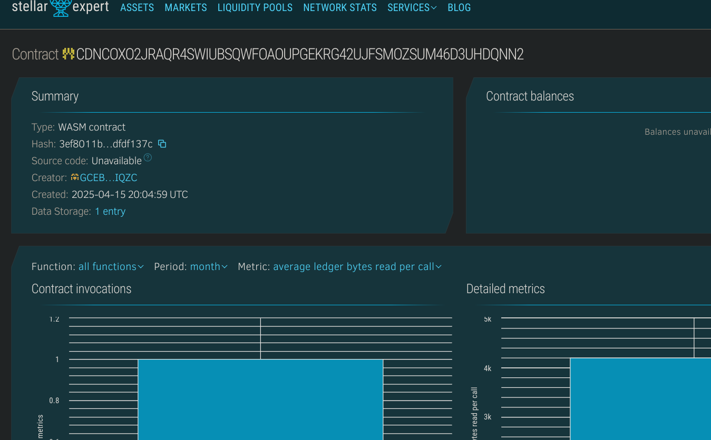

# Crypto Tip Jar

## Project Title
Crypto Tip Jar - A decentralized tipping platform for content creators built on Stellar's Soroban smart contract platform.

## Project Description
Crypto Tip Jar is a blockchain-based tipping solution that enables seamless micropayments between fans and content creators. Built on Stellar's Soroban platform, this decentralized application (dApp) allows creators to receive direct financial support from their audience without relying on traditional payment processors or centralized platforms that often charge high fees and impose restrictions.

The system allows anyone to send cryptocurrency tips to their favorite creators along with personalized messages. All transactions are recorded on the blockchain, ensuring transparency and immutability. Creators can easily track their received tips and withdraw funds whenever they want, with lower fees and faster processing times compared to traditional tipping platforms.

By leveraging blockchain technology, Crypto Tip Jar creates a direct connection between creators and their supporters, democratizing the monetization process for content creators of all sizes, from independent artists and musicians to writers, streamers, and educators.

## Project Vision
The vision for Crypto Tip Jar is to revolutionize how content creators receive financial support from their audiences. We aim to:

1. Empower creators with direct monetization tools that bypass traditional intermediaries
2. Reduce transaction fees so creators receive more of what their supporters send
3. Enable global micropayments without the limitations of traditional banking systems
4. Create a censorship-resistant platform for supporting creators regardless of content type
5. Provide transparent, real-time financial support with immediate settlement
6. Make tipping accessible to both cryptocurrency enthusiasts and newcomers
7. Build community engagement through personalized messaging with financial support
8. Democratize access to financial support for creators in regions underserved by traditional payment systems

By achieving these objectives, Crypto Tip Jar will help bridge the gap between blockchain technology and everyday creator economics, providing an essential tool for the creator economy while driving cryptocurrency adoption.

## Key Features

### Current Features:
- **Decentralized Tipping System**: Direct peer-to-peer tips without intermediaries
- **Personalized Messages**: Attach custom messages to every tip
- **Transparent Records**: All tips are publicly verifiable on the blockchain
- **Creator Profiles**: Automatic tracking of tips received by each creator
- **Low Transaction Fees**: Minimal costs compared to traditional tipping platforms
- **Immediate Settlement**: Near-instant receipt of tips
- **Secure Transactions**: Cryptographically secure tipping process
- **Withdrawal Management**: Simple process for creators to access their received funds

### Technical Implementation:
- Built on Stellar's Soroban smart contract platform
- Written in Rust for performance and security
- Stateful contract design for maintaining tip records
- Structured data storage for efficient retrieval and management
- Address-based authentication for secure access control
- Creator profile tracking for analytics and fund management

## Future Scope

### Short-term Roadmap:
- **Multi-Currency Support**: Accept various cryptocurrencies and stablecoins
- **Recurring Tips**: Subscription-based support for creators
- **Creator Pages**: Customizable landing pages for creators to share their tip jar
- **Tiered Tipping**: Reward systems for different tip amounts
- **Social Integration**: Share tipping activity on social media platforms
- **Mobile App**: User-friendly mobile interface for on-the-go tipping
- **Tipping Widgets**: Embeddable components for websites and streaming platforms
- **Anonymous Tipping**: Option for supporters to remain anonymous

### Long-term Vision:
- **Cross-Chain Compatibility**: Expand to other blockchain ecosystems
- **DAO Governance**: Community-driven decision making for platform development
- **Creator Collaboration Tools**: Split tips between multiple creators
- **NFT Integration**: Special NFTs as rewards for significant supporters
- **Content Gating**: Access to exclusive content based on tipping history
- **Loyalty Programs**: Reward systems for regular supporters
- **Advanced Analytics**: Comprehensive reporting for creators
- **Fiat On/Off Ramps**: Seamless conversion between crypto and traditional currencies
- **API Ecosystem**: Developer tools for integrating with other platforms
- **Localized Experiences**: Support for multiple languages and regional payment preferences
- **Milestone Funding**: Goal-based tipping for specific creator projects
- **Community Features**: Forums and chat for supporters to connect with creators

## Contract Details:
CDNCOXO2JRAQR4SWIUBSQWFOAOUPGEKRG42UJFSMOZSUM46D3UHDQNN2
